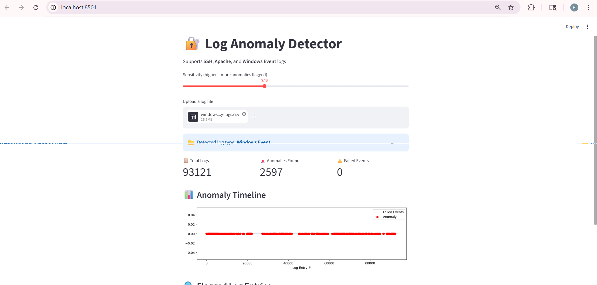
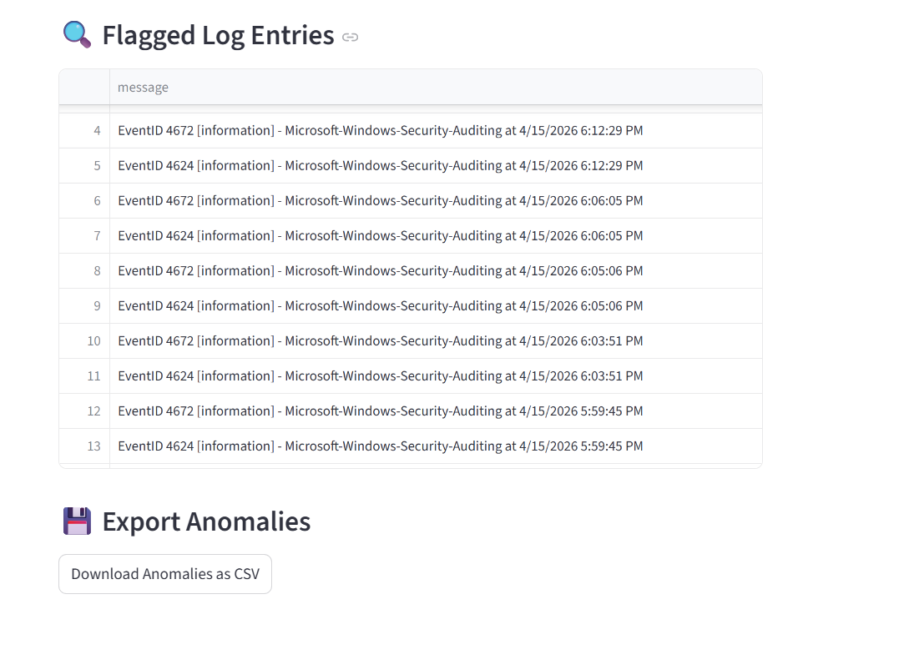

# 🔐 Log Anomaly Detector

An unsupervised ML system that detects anomalous patterns in SSH, Apache, and Windows Event logs using **Isolation Forest**.

## 🚀 Features
- Upload any Windows, SSH/auth log file
- Detects anomalies like failed logins, invalid users, root attempts
- Interactive sensitivity slider
- Visual anomaly timeline chart

## 🛠️ Tech Stack
- Python, scikit-learn, pandas, Streamlit, matplotlib

## ▶️ How to Run
streamlit run app.py

## 📊 Screenshot
Log Entries Details

Graphs
